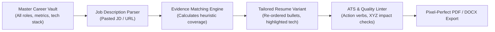

# Product Review, UX Modernization, and Niche Commercialization Plan

**Document Path**: `docs/plans/product-review-ux-and-niche-commercialization-plan.md`  
**Date**: October 2026  
**Status**: Strategic Proposal & Roadmap  
**Target Codebase**: [ai-cv-builder](file:///D:/utility-projects/ai-cv-builder)

---

## 1. Executive Summary

This project possesses **unusually strong technical fundamentals**: strict schema validation ([document.ts](file:///D:/utility-projects/ai-cv-builder/src/lib/document.ts)), deterministic DOM-based page pagination ([layout.ts](file:///D:/utility-projects/ai-cv-builder/src/lib/layout.ts)), robust SQLite/Turso persistence with transactional integrity ([database.ts](file:///D:/utility-projects/ai-cv-builder/src/lib/server/database.ts), [resumes.ts](file:///D:/utility-projects/ai-cv-builder/src/lib/server/resumes.ts)), and a **privacy-first, anti-hallucination AI contract** ([ai-proposals.ts](file:///D:/utility-projects/ai-cv-builder/src/lib/ai-proposals.ts), [ai-service.ts](file:///D:/utility-projects/ai-cv-builder/src/lib/server/ai-service.ts)) that refuses to invent candidate facts.

However, the product is currently **held back by UX friction and generic positioning**:
1. **UX Friction**: The editor is a heavy form-input interface with a 7-step modal process to rewrite a single bullet point. Editing feels like doing data entry rather than crafting a compelling career story.
2. **Generic Market Positioning**: "AI CV Builder" enters an overcrowded, low-margin market dominated by generic players (Novoresume, Resume.io, Enhancv, Rezi) spending millions on Google ads, where churn is 95%+ once a job seeker lands an offer.
3. **The Core Market Opportunity**: The biggest pain point in 2026 is **not** generating a resume from scratch—it is **customizing an authentic resume for 50+ different job postings without hallucinations or hours of manual editing**.

### Strategic Direction: The Niche
Transform the product into:  
**"The Evidence-Grounded Career Engine for Tech & Knowledge Professionals"**  
*(Tagline: "Targeted, ATS-Optimized Resumes for Every Application in 30 Seconds — 100% Grounded in Your Real Evidence.")*

---

## 2. Codebase & Architectural Audit

### 2.1 Technical Strengths
- **Strict Data Contracts & Invariants**: Uses Zod runtime validation with `documentSchema` in [document.ts](file:///D:/utility-projects/ai-cv-builder/src/lib/document.ts). Revisions, dates, and item IDs are guaranteed to be unique and consistent.
- **Physical Layout & Real Pagination**: Rather than guessing page heights with CSS print hacks, [layout.ts](file:///D:/utility-projects/ai-cv-builder/src/lib/layout.ts) and [resume-preview.tsx](file:///D:/utility-projects/ai-cv-builder/src/components/resume-preview.tsx) compute block heights, preserve headings with following text, split long blocks at word boundaries, and ensure preview-to-print parity across A4 and Letter sizes.
- **Ethical, Guarded AI Pipeline**:
  - Does not leak contact details or foreign entries to the model.
  - Generates structured edit proposals with explicit diffs.
  - Employs a secondary semantic verification check to reject hallucinated credentials or unsupported metrics.
- **Transactional Persistence**: SQLite/Turso integration with Drizzle in [resumes.ts](file:///D:/utility-projects/ai-cv-builder/src/lib/server/resumes.ts) guarantees atomic saves, revision conflict rejection, and cascading deletions with quotas and durable retry receipts.

### 2.2 Technical Bottlenecks & Code Architecture Debt
1. **Monolithic UI Component**: [resume-studio.tsx](file:///D:/utility-projects/ai-cv-builder/src/components/resume-studio.tsx) is over 1,200 lines long, managing document loading, autosave timers, undo stacks, modal visibility, section state, field mutations, and layout rendering all in one component. This makes UI iterations sluggish and testing UI subcomponents difficult.
2. **No Cold-Start Import Engine**: Currently, the only import options are JSON backup restore ([parseBackup](file:///D:/utility-projects/ai-cv-builder/src/lib/document.ts#L207)) or loading a synthetic sample. Real users have existing PDF or DOCX resumes; without a parser, onboarding has high drop-off.
3. **Modal Isolation for AI**: The AI logic is confined to [ai-panel.tsx](file:///D:/utility-projects/ai-cv-builder/src/components/ai-panel.tsx). It operates outside the editor flow rather than as an inline assistant directly on bullets and summaries.
4. **Desktop-First DOM Scaling**: Preview scaling in [resume-preview.tsx](file:///D:/utility-projects/ai-cv-builder/src/components/resume-preview.tsx) uses a single `ResizeObserver` scaling down to fit the stage width. On smaller laptops or split windows, the preview becomes tiny and hard to read without zoom controls.

---

## 3. UX & UI Review: Pain Points & Solutions

| Area | Current Experience | User Friction | Recommended Modern UX |
| :--- | :--- | :--- | :--- |
| **Bullet Editing** | Textarea with standalone "Add bullet" and "×" buttons | Disconnected from writing flow; feels like filling a database form | **Rich List Flow**: Press `Enter` to create next bullet, `Backspace` on empty line to remove, drag-and-drop handles for reordering. |
| **AI Rewriting** | Click "AI bullet assistant" -> select bullet in dropdown -> type instruction -> check consent -> submit -> review -> check confirm -> accept | 7+ clicks per bullet; user loses visual context of where the bullet sits in the resume | **Inline Contextual Magic Bar**: Hovering on any bullet shows a floating action chip (`✨ Improve`, `📊 Add Metric`, `🎯 Match Job`). Clicking gives an instant in-place diff with 1-click Accept (`Tab`) or Dismiss (`Esc`). |
| **Document Navigation** | Left sidebar with numbered tabs (01 Personal, 02 Profile, etc.) | Jumping between sections requires clicking tabs; user cannot see whole resume flow in one scrollable view | **Continuous Document Editor with Sticky Section Rail**: Scrollable single-page canvas with an anchored table of contents, or bidirectional sync where clicking any section in the preview jumps directly to that section in the editor. |
| **Preview Interactivity** | Purely visual, read-only paper render | If user spots a typo in preview, they must hunt for the corresponding form input on the left | **Click-to-Edit Sync**: Clicking any text element in the preview highlights and focuses the exact input in the editor. |
| **First-Run Experience** | Blank inputs or fictional Alex Morgan sample | "Blank page paralysis"; users don't know how to phrase achievements or what recruiters look for | **Smart Import & Role-Based Starter Kit**: 1-click PDF/LinkedIn drop zone, followed by an interactive 3-step setup ("What role are you targeting? Paste a job description or select level"). |
| **Quality Feedback** | None; user has no idea if bullets are strong or weak | User worries: "Is this ATS friendly? Is it too long? Are my verbs passive?" | **Real-Time Content Linter**: Live badges on each bullet (e.g. `⚠️ Missing quantifiable outcome`, `✅ Strong action verb`, `📏 Good length`). |

---

## 4. Market Positioning: Solving an Acute Niche Pain

### 4.1 Why Generic Resume Builders Fail
- **High CAC, Low LTV**: Resume building is a transactional event. Users need it for 2–6 weeks, then cancel.
- **Recruiter Backlash against AI Fluff**: Recruiters increasingly discard generic ChatGPT-written resumes filled with empty buzzwords (*"spearheaded synergistic paradigms"*).
- **The True Job Seeker Nightmare**: Applying for 50–100 jobs on LinkedIn/Indeed requires tailoring the resume each time. Doing this by hand takes 60 minutes per job. Using ChatGPT takes 15 minutes but introduces hallucinations, invents skills, and ruins document formatting.

### 4.2 The Winning Niche: Mid-to-Senior Tech & Knowledge Workers
- **Target Profiles**: Software Engineers, Product Managers, Data Scientists, DevOps/SREs, System Architects, Solutions Consultants.
- **Demographics**: Experienced professionals who have 5–15 years of accomplishments, side projects, and skills, but struggle to compress and tailor them to specific job descriptions.
- **Willingness to Pay**: Extremely high. Landing an interview for a $120k–$250k role easily justifies $20–$50 during an active search.

### 4.3 The Value Proposition & Product Moat
> **"The Anti-Hallucination Resume Engine"**  
> Maintain one **Master Career Vault** of all your verified experience, tech stack, and achievements. For every job you apply to, paste the job description to get a **tailored, 1-page ATS-verified resume in 30 seconds**—grounded entirely in your real career evidence.

---

## 5. Key Feature Innovations

### 1. The Master Career Vault (Source of Truth)
- Instead of just saving static resumes, users build an accumulated **Career Vault**:
  - 10–20 comprehensive bullets per job.
  - Full list of tools, libraries, certifications, and project artifacts.
- When exporting a targeted resume, the app selects the top 3–5 most relevant bullets for the target job while preserving the master library.

### 2. The 1-Click Job Tailoring Engine ([SKILL: resume-builder-ai](file:///D:/utility-projects/ai-cv-builder/.agents/skills/resume-builder-ai/SKILL.md))
- User pastes a job posting.
- System extracts:
  - **Hard Requirements** (e.g., "5+ years Kubernetes, Go, distributed systems").
  - **Preferred Qualifications** (e.g., "Terraform, GCP").
  - **Key Responsibilities & Soft Signals**.
- Engine compares against the candidate's Career Vault:
  - **Matched Evidence**: Points directly to candidate bullets proving the requirement.
  - **Skill Gaps**: Highlights missing requirements so the user can either add real experience or acknowledge the gap.
  - **Targeted Bullet Suggestions**: Rewrites existing bullets to emphasize the relevant technologies already present in the candidate's history without inventing false claims.

### 3. Google XYZ Impact Coach
- Detects whether bullets conform to the proven **Google XYZ Formula**:  
  *"Accomplished [X], as measured by [Y], by doing [Z]."*
- AI prompts user: *"You mentioned improving latency. By what percentage or millisecond count? (e.g. reduced P99 latency by 35%)"*.
- Once the user provides the number, the bullet is updated with genuine, verified impact.

### 4. ATS Parse & Format Verifier ([SKILL: resume-builder-templates](file:///D:/utility-projects/ai-cv-builder/.agents/skills/resume-builder-templates/SKILL.md))
- Displays an **ATS Plain-Text Diagnostic Tab**: Shows exactly what an ATS parser extracts from the generated PDF.
- Verifies:
  - Text reading order (especially for sidebar layouts like Creative).
  - Absence of tables, icons, or text boxes that confuse older ATS engines (Workday, Taleo).
  - Standard date formats and contact hyperlinks.

---

## 6. Business & Monetization Model

### 6.1 Pricing Tiers

| Tier | Price | Target Audience | Features |
| :--- | :--- | :--- | :--- |
| **Free / Local** | $0 | Casual users / Evaluators | Unlimited local editing, 1 active resume variant, Classic template, browser print PDF with subtle watermark, plain text export. |
| **Job Hunter Pass** | **$19 / month** or **$9 / week** | Active job seekers (2–8 weeks) | Unlimited tailored variants, Cloud sync, all 4 premium templates, Master Career Vault, 1-Click Job Tailoring (50 applications/mo), ATS Coverage Report, watermark-free PDF & DOCX. |
| **Lifetime / Power** | **$79 one-time** | Long-term career managers | Lifetime access to Master Career Vault, ongoing annual updates, unlimited tailoring, priority AI processing. |

### 6.2 Conversion Funnel & Lead Magnets
1. **Free ATS Resume & Job Match Grader (No signup required)**:
   - User uploads their current PDF resume and pastes a job description.
   - The tool outputs an **Instant Coverage Breakdown** showing matched keywords, missing requirements, and weak bullets.
   - Call to Action: *"Fix these 4 gaps and download a tailored version in 60 seconds with AI CV Builder."*
2. **Watermark / Feature Gate**:
   - Free users can build and preview everything.
   - Exporting the clean, high-resolution PDF or creating tailored variants prompts upgrade.

---

## 7. Phased Implementation Roadmap

### Phase A: UX Modernization & Editor Refactor
- [ ] **Split `resume-studio.tsx`**: Decompose the 1200-line monolith into modular components:
  - `src/components/editor/EditorSidebar.tsx` (navigation & document meta).
  - `src/components/editor/SectionEditor.tsx` (section-specific inputs).
  - `src/components/editor/BulletList.tsx` (streamlined keyboard-driven bullet editing).
  - `src/components/editor/EditorHeader.tsx` (status, workspace toggle, export triggers).
- [ ] **Bidirectional Preview Sync**:
  - Add `data-block-id` click listeners on [resume-preview.tsx](file:///D:/utility-projects/ai-cv-builder/src/components/resume-preview.tsx) that scroll to and highlight the corresponding input in the editor.
- [ ] **Inline AI Action Bar**:
  - Replace the heavy modal in [ai-panel.tsx](file:///D:/utility-projects/ai-cv-builder/src/components/ai-panel.tsx) with a lightweight, contextual popover directly on the active bullet.
  - Provide quick actions: *"Strengthen Action Verb"*, *"Add XYZ Metric"*, *"Make More Concise"*.
  - Keep the strict anti-hallucination verification step, but display the diff right below the active bullet with 1-click Accept.

### Phase B: PDF Import & Cold-Start Onboarding
- [ ] **Client/Server PDF & Text Importer**:
  - Add drag-and-drop resume upload on the welcome screen.
  - Extract text and parse into the canonical `documentSchema` using a structured schema extraction prompt (or local regex parser for basic sections).
  - Display an import review screen to confirm parsed entries before saving.

### Phase C: Master Career Vault & Job Description Tailoring
- [ ] **Data Model Extension**:
  - Introduce `vault` storage in [database.ts](file:///D:/utility-projects/ai-cv-builder/src/lib/server/database.ts) to hold a candidate's complete master inventory of bullets and skills.
- [ ] **Job Tailoring Interface**:
  - Add a "Tailor for Job" modal: user pastes Job Title, Company, and Job Description.
  - Implement heuristic requirement extraction and coverage scoring.
  - Generate an isolated, named resume variant (e.g. *"Staff SWE – Stripe"*), selecting and re-ranking the most relevant bullets from the vault.

### Phase D: ATS Heuristic Quality Linter
- [ ] **Deterministic Writing & Formatting Audit**:
  - Implement real-time heuristics:
    - Flag weak/passive verbs (*"responsible for"*, *"helped with"*).
    - Detect missing metrics/numbers in experience bullets.
    - Check bullet length (warn if < 5 words or > 40 words).
    - Validate section completeness and consistent date formatting.
  - Display an overall "Resume Strength & ATS Readiness" indicator with actionable recommendations.

### Phase E: Production Infrastructure & Monetization
- [ ] **Deploy Database & App**:
  - Provision live Turso/libSQL database.
  - Configure production environment variables (`TURSO_DATABASE_URL`, `TURSO_AUTH_TOKEN`, `OPENAI_API_KEY`).
  - Deploy to Vercel or Fly.io.
- [ ] **Stripe Checkout & Billing Integration**:
  - Add webhook handling for subscription lifecycle (Active Job Hunter pass).
  - Gate cloud tailoring and watermark-free exports behind active subscription.

---

## 8. Verification & Success Metrics

1. **UX Speed to Edit**: Time required to rewrite a single bullet with AI drops from > 30 seconds (modal navigation) to < 8 seconds (inline trigger).
2. **Onboarding Conversion**: Over 65% of new visitors successfully create or import a resume in their first session (vs < 20% with manual empty form fields).
3. **Tailoring Utility**: Generating a tailored resume for a specific job takes under 60 seconds and produces a measurable increase in ATS keyword coverage without adding false statements.
4. **Code Quality**: Zero type errors (`npm run typecheck`), 100% pass rate on domain and Playwright tests (`npm test`, `npm run test:e2e`), and zero regressions on the 24 validated PDF template matrix.
